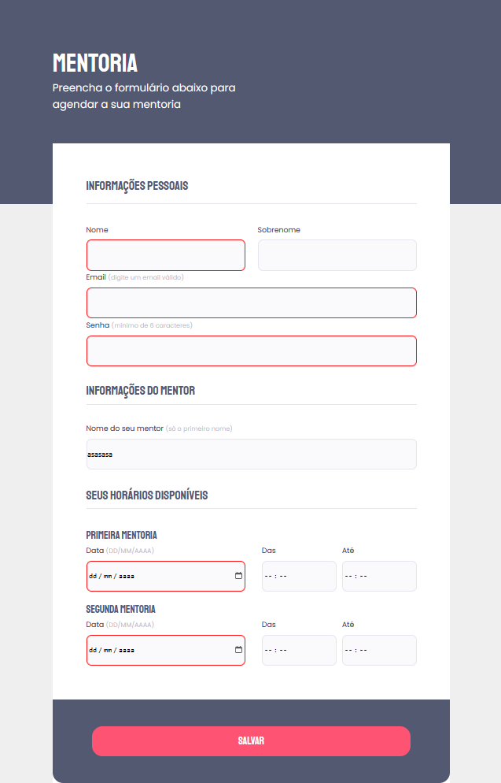

# Desafio
O desafio consistia em construir um formulario com base no desafio da Rocketseat de criar formulario 
[Link do desafio](https://efficient-sloth-d85.notion.site/Criando-formul-rios-462826c68ea54d61b1eff955158d1a6d#c242c51159e34e519823f42245a527a1)

# Tecnologias / linguagens usadas
HTML e CSS

# conceitos mais especificos aplicados
Forms, legend, button,

# Resultado
